## Formula Facts

## Bemutatás

Hamarosan kezdődik az új Formula-1 szezon, ennek kapcsán jött az ötletem, hogy egy olyan alkalmazást készítek, amely segítségével a felhasználók könnyen nyomon követhetik az eredményeket és akár korábbi évek, pilóták és futamok adatait is meg lehet tekinteni. Jó lenne tisztában is lenni mindig, mikor épp nagydíj van a hétvégén, erről értesítést kapni. A [publikus API-knál](https://github.com/public-apis/public-apis) találtam ehhez az Ergast F1 API-t, de ez deprecated, új verziója a [jolpica-f1](https://github.com/jolpica/jolpica-f1). Ennek segítségével lehet majd különböző adatokat megtekinteni.

## Főbb funkciók

Az applikációban lehetőség lesz a következőkre:

- Pontverseny (egyéni és csapat) aktuális állásának megtekintése
- A korábbi szezonok, konstruktőrök és pilóták adatainak megtekintése
- Versenyek és időmérők eredményeinek megtekintése
- Következő nagydíj helyszínéről és időpontjáról értesítés beállításának lehetősége
- Offline mód: amikor nincs internetkapcsolat, akkor is elérhetőek korábban letöltött adatok

Actorok:

- Felhasználó: az alkalmazást használó személy, feltehetően F1 rajongó

User story-k:

- A felhasználó az aktuális egyéni és konstruktőri pontverseny állását akarja megnézni
- A felhasználó értesítést szeretne kapni, mikor indul a következő nagydíj és az időmérője
- A felhasználó meg szeretné nézni a legfrissebb eredményeket, hogy tudja miről maradt le
- A felhasználó nosztalgiázni szeretne, és vissza szeretné nézni a korábbi évek eredményeit, a pilóták és konstruktőrök adatait

Use case diagram:

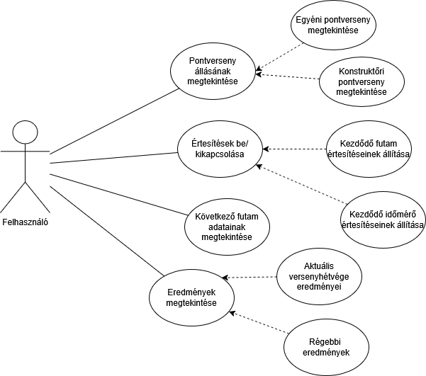

## Képernyőtervek

### Főoldal:

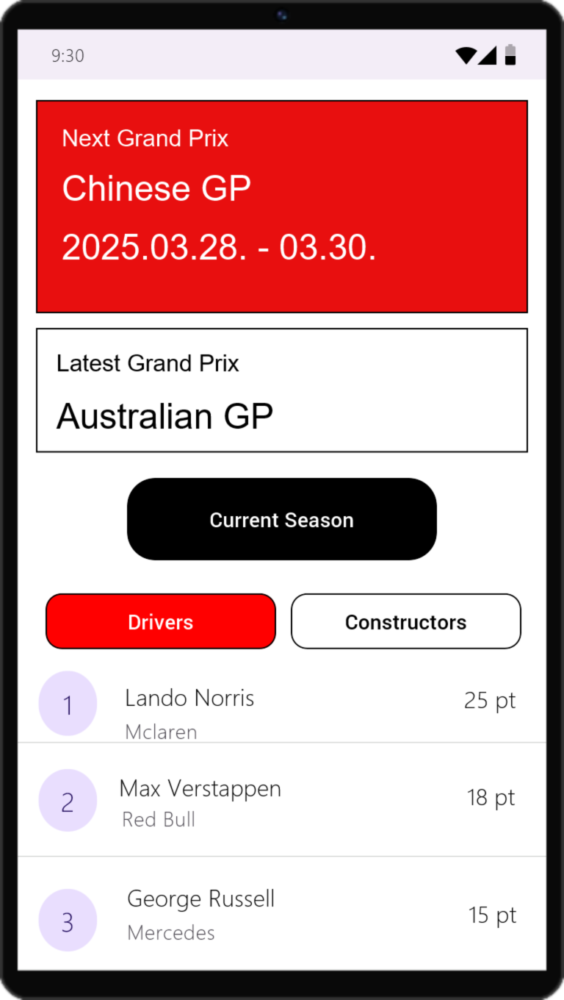
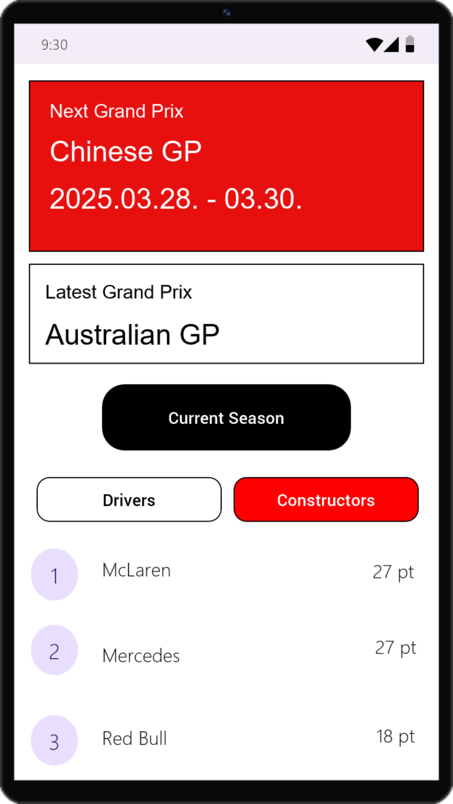
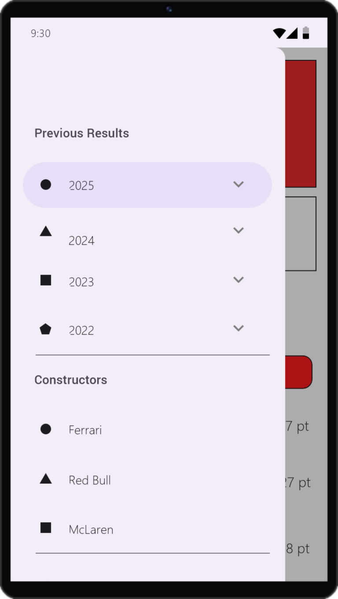

### Szezon képernyő:

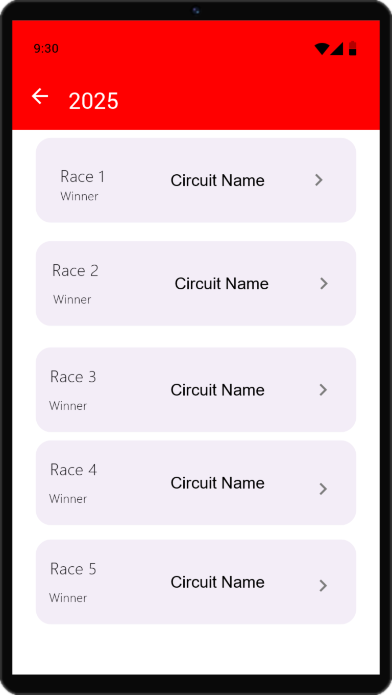

### Futam képernyő:

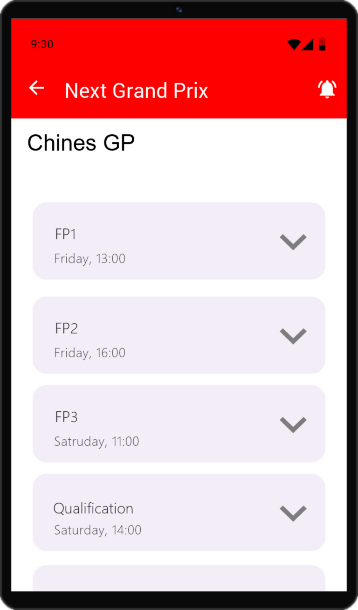

### Pilóta képernyő:

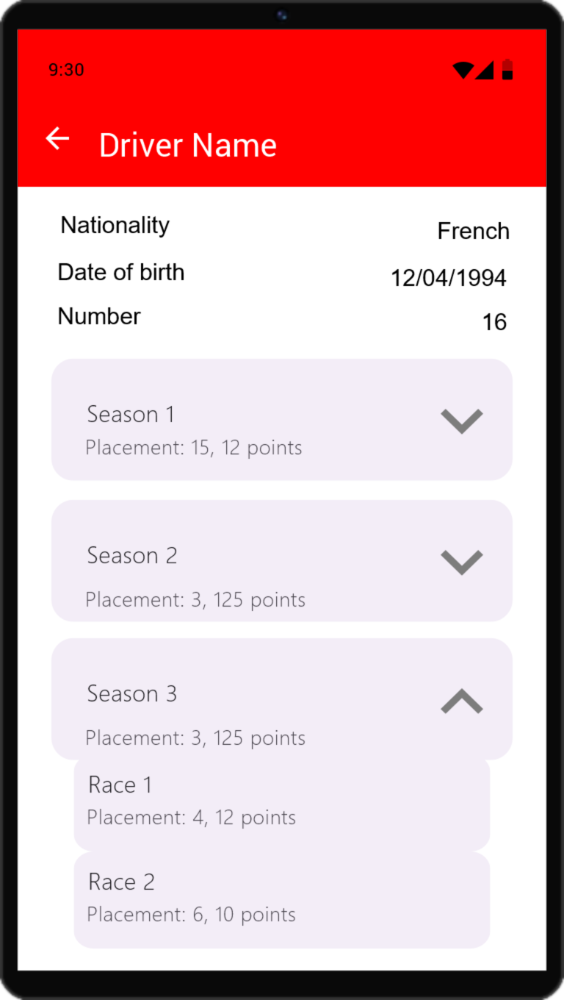

### Konstruktőr képernyő:

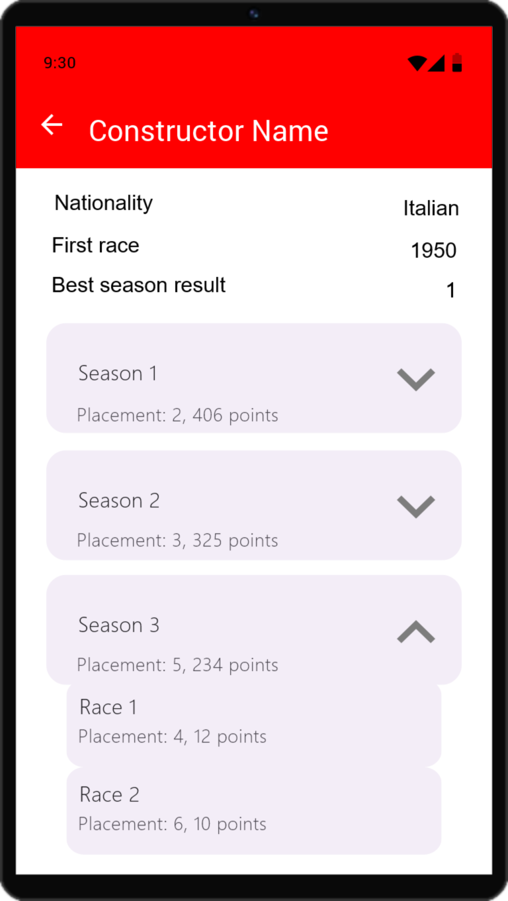

## Architektúra

Az alkalmazás architektúrájának MVVM-et választottam, mivel ez az egyik legelterjedtebb és legjobban karbantartható architektúra Android platformon. A függőségek kezeléséhez és injektálásához a Hilt-et használom, hiszen ez a standard megoldás Androidon.

A hálózati kommunikáció a FormulaService interfészen keresztül történik, amelyet a Retrofit segítségével valósítok meg. AZ app képes lesz korábban letöltött adatokat is megjeleníteni offline módban. Ehhez a Room adatbázist használom majd, melyet a FormulaLocalRepository osztályon keresztül érek el. A kettőt fogja összefogni a FormulaOneRepository osztály, amely a ViewModel-eknek szolgáltatja majd az adatokat szintén ez fogja eldönteni - a hálózati kapcsolódás függvényében - hogy melyik adatforrásból kérje le az adatokat.

Az értesítések kezeléséhez használok egy DataStore-t, ahol azt tárolom, hogy a felhasználó értesítéseket szeretne-e kapni a következő nagydíjról. BroadcastReceiver segítségével fogom majd kezelni az értesítéseket. Az értesítések beállításához egy NotificationAlarmScheduler osztályt használok majd. Újraindulásnál elveszhetnek a beállított alarmok, ezért egy BootCompletedReceiver segítségével újra beállítom őket.

## Commitok a brancheken

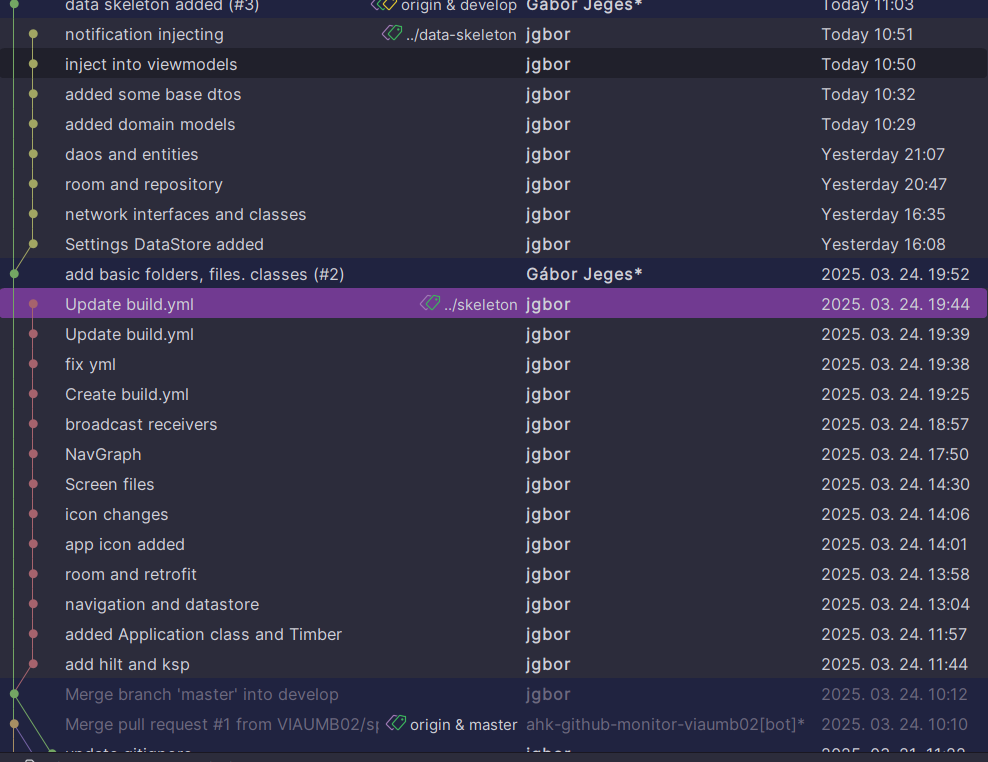

## Github Actions

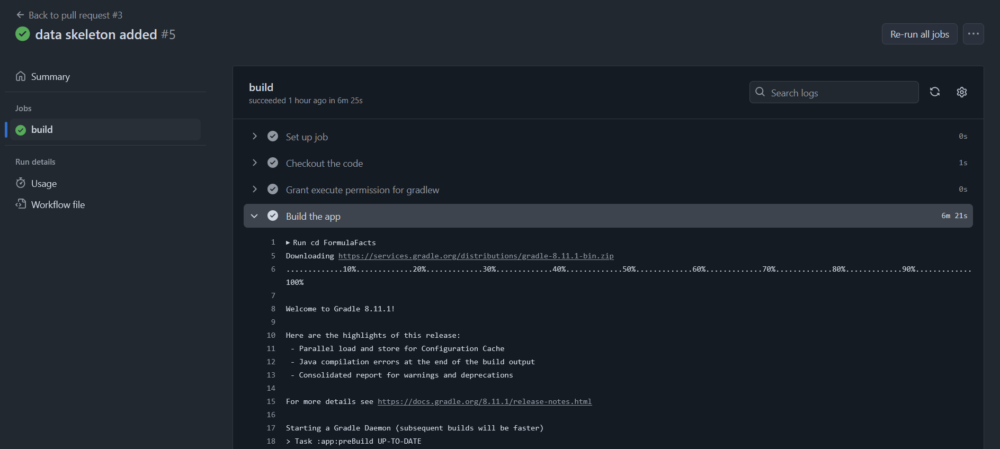

## Hálózati kommunikáció

Az api dokumentációja [itt](https://github.com/jolpica/jolpica-f1/blob/main/docs/README.md) található. Mivel nincs hozzá publikus API leíró, nekem kellett elkészíteni az [openapi.yaml](openapi.yaml) fájlt. Ebben csak az általam használt végpontok szerepelnek. Az API alapvetően egy szerkezetű választ küld mindig, amiben több property is mindig benne van, és a lényeg bizonyos opcionális elemekben található. Erre létrehoztam a `JolpicaAnswer` osztályt, amely a válaszokat reprezentálja. Ebben van az MRData, ami tartalmazza különböző eredményeket nullable formában, így csak az aktuálisan számunkra fontos propertynek lesz értéke.

 Az API végpontjait a `JolpicaAPIRetrofit` interfész tartalmazza, amelyet a Retrofit segítségével valósítok meg.
 A `FormulaService` interfész tartalmazza a különböző függvényeket, amelyeket a hálózati kérések indítására szolgálnak. Ezek a függvények a `JolpicaApi`-ban vannak implementálva. Ez az osztály alakítja át a DTO-kat a domain modellekre, valamint, mivel limit van a visszaküldött objektumok számán, lekéri a maradékot, ha szükséges.

## Lokális adatbázis

A lokális adatbázis a Room segítségével valósul meg. Az adatbázisban tárolt adatok a következőek:

- Pilóták (DriverEntity)
- Konstruktőrök (ConstructorEntity)
- Futam információk (RaceEntity)
- Futam eredmények (RaceResultEntity)
- Időmérők (QualifyingResultEntity)
- Szezonok (SeasonEntity), egy pilóta és egy konstruktőr több szezonban is versenyezhetett, ezért kellett egy tábla a pilóta és a konstruktőr szezonnal lévő kapcsolatára is (DriverSeasonCrossRef, ConstructorSeasonCrossRef).
- Pilóta pontok (DriverStandingEntity), egy pilóta egy évben akár több csapatban is versenyezhetett, ezért kellett egy tábla a pilóta és a csapat közötti kapcsolatra is (DriverStandingConstructorCrossRef).
- Konstruktőr pontok (ConstructorStandingEntity)

Mindegyik főbb entitáshoz létrehoztam egy DAO-t, amely tartalmazza a lekérdezéseket és a módosítások (ConstructorDao, DriverDao, RaceDao, SeasonDao, StandingDao).
4 típusátalakító objektumot is ltérehoztam, hogy a menteni kívánt, nem primitive típusokat el tudjam menteni a Room adatbázisba. Ezek a következőek:

- `RaceTypeConverter`: a verseny eredményének típusát alakítja át (sprint, nagydíj)
- `LocalDateConverter`: a LocalDate típusú dátumokat alakítja át a Room által használt Long típusra
- `InstantConverter`: az Instant típusú dátumokat alakítja át a Room által használt Long típusra
- `StandingKeyConverter`: a pilóta és a konstruktőr pontversenyének kulcsait alakítja át a Room által használt String típusra, a kulcs egyébként egy string, amely tartalmazza az évszámot és a helyezést kombinálja (pl. 2023-1, 2023-2, stb.).

Ezeket mind hozzáadatam a `FormulaOneDatabase` absztrakt osztályhoz, melyből a Room legenerálja az adatbázis osztályát. 4 lokális repository-t is létrehoztam, amelyek a különböző főbb adatokkal foglalkoznak, így kérhetőek le az adatok az adatbázisból (`DriverLocalRepository`, `ConstructorLocalRepository`, `GrandPrixLocalRepository`, `SeasonLocalRepository`).

## DataSource

Az adatok lekérdezéséhez egy `FormulaOneRepository` interfészt hoztam létre, amely tartalmazza a különböző lekérdezéseket. Ezt implementálja a `FormulaOneRepositoryImpl` osztály, amely a lokális és a távoli adatforrást is kezeli. Ennek az osztálynak a feladata, hogy ellenőrizze az internetkapcsolatot, és ha van, akkor a távoli adatforrást használja, ha nincs, akkor a lokális adatforrást. Az interfész tartalmazza a különböző lekérdezéseket, amelyeket a ViewModel-ek hívnak meg. A `FormulaOneRepositoryImpl` osztályban található egy `getData()` függvény, amely a távoli adatforrástól kéri le az adatokat, és ha sikeres a lekérdezés, akkor elmenti azokat az adatbázisba is, ha nincs internetkapcsolat vagy hiba történik a kérés közben, akkor a lokális adatforrást használja.

Természetesen minden elem dependency injection-nel kerül be a ViewModel-be. A`FormulaOneRepositoryImpl`-be is a lokális repositoryk és a service így kerülnek be.

## UI és ületi logika

A videó az appról [itt](https://youtu.be/3-tWH6ZTa4I) található.

## Analytics

Amikor egy-egy oldalra navigálunk, akkor a Google Analytics segítségével nyomon követjük, hogy a felhasználók mely csapatokat, pilótákat, futamokat, szezont nézik meg. Raktam eventet az értesítések beállítására is, hogy lássam, hányan használják ezt a funkciót, ahol paraméter az, hogy milyen típusú értesítést kértek (szabadedzés, időmérő, nagydíj). Analytics eredmények view_itemre a különböző objektumokkal:

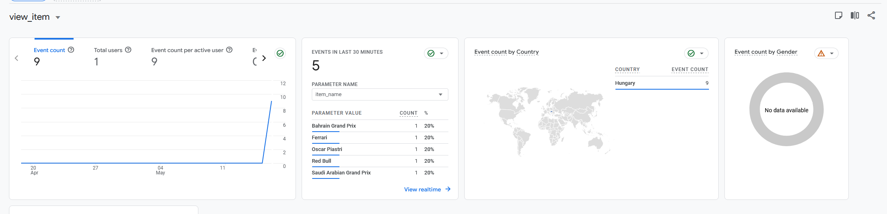

## Crashlytics

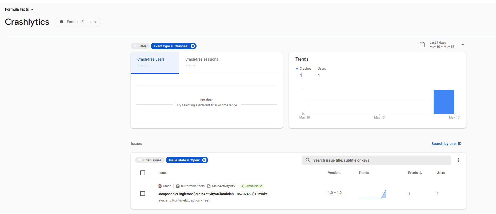

## Unit tesztelés

A teszteléshez JUnit4-et használtam, a JolpicaApi osztályt teszteltem, amely a hálózati kérésekért és a json konvertálásért felelős. A teszteléshez MockWebServer-t használtam, amely lehetővé teszi a hálózati kérések szimulálását és a válaszok ellenőrzését. A tesztelés során ellenőriztem, hogy a hálózati kérések helyesen működnek-e, és hogy a válaszok helyesen konvertálódnak-e a DTO-kra, majd a domain modellekre. A tesztelés során az apiból vett valós válaszokat használtam, picit módosítva, hogy kevesebb adatot tartalmazzon (pl. az összes ember eredménye, összes csapat stb. helyett csak 3 dolog van a listákban).

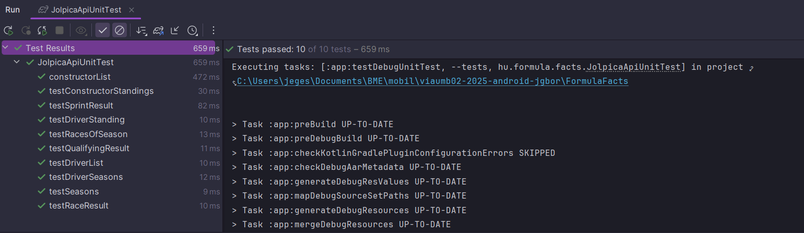
